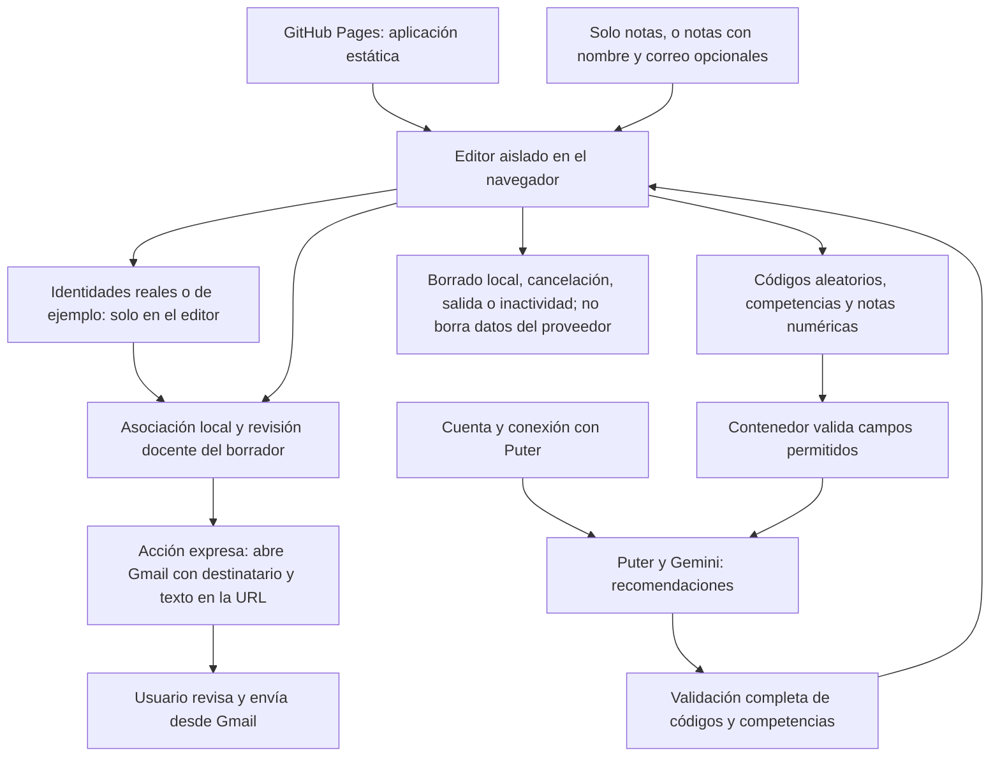

# Retroalimentación de competencias clave

Documentación actualizada: 9 de octubre de 2026. Mantiene **Gemini mediante Puter, recomendaciones personalizadas y preparación del borrador en Gmail**. La publicación del código no acredita autorización institucional de uso real.

## Adecuación al RGPD

Documentación revisada el 9 de octubre de 2026 a partir de los diagramas del informe inicial y del código actual. Describe las medidas implementadas; la configuración y autorización de producción deben comprobarse aparte.

CC-feedback incorpora minimización de datos y aislamiento del editor: la petición a Puter/Gemini contiene códigos aleatorios, competencias y notas, sin nombres ni correos del alumnado. Si se introducen solo notas, los identificadores de ejemplo se crean localmente. Esto reduce la posibilidad de identificación por el proveedor, pero si el docente conserva el orden o la hoja original para asignar las recomendaciones, el centro sigue tratando datos personales. Una cuenta genérica no garantiza anonimato: el proveedor trata también datos de cuenta y conexión. La posibilidad de identificación debe valorarse según los medios razonablemente disponibles. El borrado local no elimina peticiones recibidas por proveedores ni mensajes de Gmail.

Estos controles apoyan la adecuación al RGPD, pero no acreditan por sí solos el cumplimiento ni sustituyen la autorización del centro. Antes del uso con datos reales deben verificarse en el despliegue, completar la información de privacidad, revisar proveedores y condiciones de tratamiento y aprobar la conservación y el borrado, incluidas copias y exportaciones.

El aviso se mantiene en `privacidad.html`; GitHub Pages no carga variables de un archivo `.env`.

[Guía de privacidad](docs/PRIVACIDAD_Y_ACTUALIZACION.md) · [Web](https://cuatrovientos-ci.github.io/cc-feedback/).

## Flujo de funcionamiento y datos




## Datos separados antes de llamar a la IA

1. `index.html` conecta con Puter. No contiene nombres, correos ni filas originales.
2. `editor.html` recibe las filas dentro de un iframe aislado, con origen opaco (`sandbox` sin `allow-same-origin`). No carga Puter ni recursos remotos; su política impide conexiones de datos. El SDK del contenedor no puede leer su documento.
3. Se validan las cabeceras y los valores. Se conservan nombre, correo y total dentro del editor; a cada fila se asigna un UUID nuevo para esa operación.
4. Solo se comunican al contenedor `{id, competencias: [{competencia, valor}]}`. Este vuelve a construir una lista de campos permitidos antes de llamar a la IA. No hay envío de filas originales como alternativa ante errores.
5. Gemini devuelve recomendaciones. Se exige una correspondencia completa de códigos y competencias, sin duplicados. La asociación local utiliza el código, nunca el orden de respuesta. Nombres, correos, notas y total mostrados proceden de la entrada docente, no del modelo.
6. El docente revisa y adapta el borrador. Al editarlo se desmarca la revisión. Gmail se abre por una acción expresa y con el destinatario local; no se envía ningún correo automáticamente.

La separación de identificadores reduce la exposición de datos. Consulta el apartado de adecuación al RGPD para distinguir la información recibida por la IA de la correspondencia conservada por el docente.

## Uso

Servir los archivos por HTTPS (o localhost para pruebas), no abrirlos como `file://`.

1. Pulsar «Conectar con Puter / Gemini». La primera pulsación muestra «Cargando servicio…» y después cambia el propio botón a «Acceder a Puter / Gemini». La segunda inicia sesión y muestra «Accediendo…» hasta terminar.
2. Pegar celdas tabuladas o texto sin cabecera: cabecera opcional, nombre opcional, Email opcional, seis competencias y Total opcional. Sin cabecera se admite texto separado por espacios o celdas tabuladas. Si falta el nombre se usa Alumno1, Alumno2, etc.; si falta el correo se usa alumno1@example.invalid, alumno2@example.invalid, etc., marcado como ejemplo.
3. Se admiten las nueve subcompetencias originales: Innovación, Emprendimiento, Trabajo en equipo, Comunicación oral, Comunicación escrita, Competencia digital, Adaptación al entorno, Autonomía y Responsabilidad. También las seis cabeceras `Competency 1 Level` a `Competency 6 Level`, mapeadas a las seis categorías generales del prompt original.
4. Introducir notas 0–10 (hasta dos decimales, coma o punto), sin texto libre. Las competencias vacías no se envían. No se admiten texto libre, diagnósticos ni columnas desconocidas. Las notas no se convierten automáticamente a niveles, porque la escala original dejaba huecos.
5. Generar, revisar cada recomendación y destinatario y abrir Gmail con una cuenta institucional autorizada. Las recomendaciones siguen siendo redactadas por la IA, no son plantillas locales.

El iframe permite el evento local del formulario con `allow-forms`, mientras `form-action none` bloquea envíos nativos a servidores. Usa `allow-popups` y `allow-popups-to-escape-sandbox` para Gmail, con `noopener,noreferrer`; **no añadir `allow-same-origin`**, porque anularía el aislamiento frente al SDK del contenedor. El uso directo de `editor.html` no permite generar.

## Límites y conservación

- Máximo 100 personas / 100.000 caracteres de entrada. Valores y cabeceras permitidos exclusivamente.
- No se guardan identidades en cookies o almacenamiento web de la aplicación. La cuenta/sesión del SDK Puter tiene sus propias condiciones.
- Las identidades se mantienen en memoria y en los borradores; se retiran al borrar, salir o tras 15 minutos de inactividad. La suspensión del navegador puede retrasar el temporizador; se comprueba también al volver a interactuar.
- Cancelar descarta respuestas posteriores, pero no retira una petición ya recibida por Puter. El borrado local no asegura sobrescritura física ni borra copias externas.
- Abrir Gmail incluye el texto y el destinatario en una URL de Google, como en la funcionalidad original. Es una transferencia identificada deliberada al canal de correo, distinta de la petición seudonimizada a IA. Puede quedar en historial/registros. La pantalla advierte antes de abrirlo.
- El código externo del proveedor continúa siendo una dependencia de confianza para las peticiones seudonimizadas. El aislamiento no certifica anonimato ni cumplimiento legal.

## Publicación, autorización y pruebas

Ver [guía de actualización](docs/PRIVACIDAD_Y_ACTUALIZACION.md) y [privacidad](privacidad.html). La web sigue en GitHub Pages, no en PythonAnywhere. La migración en curso de las cinco aplicaciones de PythonAnywhere a Europa no incluye CC-feedback ni el portal.

`node --test tests/core.test.cjs`: trece pruebas de separación, validación y correspondencia.

`node tests/browser.cjs`: Playwright con Chromium instalado; opcional `CC_BROWSER` para la ruta de otro navegador Chromium. Prueba el SDK con una respuesta simulada, sin datos reales ni consumo de IA. Comprueba aislamiento, peticiones sin identificadores, recomendaciones, reordenación, revisión, Gmail, borrado y contenido malicioso. No sustituye una prueba real de autenticación y generación con una cuenta autorizada y datos ficticios.

Archivos para publicar: `index.html`, `editor.html`, `core.js`, `app.js`, `editor.js`, `rubricas.js`, `style.css`, `shell.css`, `privacidad.html` y `assets/` (Bootstrap local y licencia). `prompt.toon` queda como referencia original; las rúbricas se sirven localmente desde `rubricas.js`. No subir hojas ni capturas con datos reales.

### Entrada sin cabecera

Orden fijo: Nombre (opcional), Innovación y Emprendimiento, Trabajo en Equipo, Capacidad Comunicativa, Competencia Digital, Adaptación al Entorno, Autonomía y Responsabilidad y Total (opcional). El correo, si se incluye sin cabecera, va después del nombre. El total ausente no se calcula.

```text
Alumno1 5 5 6 4 6 7
Alumno2 6 5 4 3 4 5
```

También se admite pegar solo las seis notas: el nombre y correo de ejemplo se generan localmente. Con cabecera tabulada se reconocen los nombres numerados del 1 al 6, con o sin acentos, y pueden omitirse las columnas Nombre y Email. Sustituir el correo de ejemplo en Gmail antes de enviar. Las direcciones example.invalid no son destinatarios reales.

### Estado visible y revisión compacta

Durante la generación se muestra una capa con indicador de actividad, fase (espera, recepción o comprobación), segundos transcurridos y Cancelar. No indica un porcentaje inventado. Los fallos muestran una explicación y un código de diagnóstico controlado, sin reproducir datos del proveedor; conservan la entrada en el editor para corregir o reintentar. Borrar o cancelar sí retira los datos locales; no retira una petición ya recibida por el proveedor.

Los resultados aparecen colapsados por persona, con nombre y correo. Pulsar Revisar borrador abre el texto editable y la confirmación necesaria para preparar Gmail. Editar el texto vuelve a exigir revisión. Los mensajes de acceso normales aparecen en el propio botón; solo los errores aparecen aparte.
