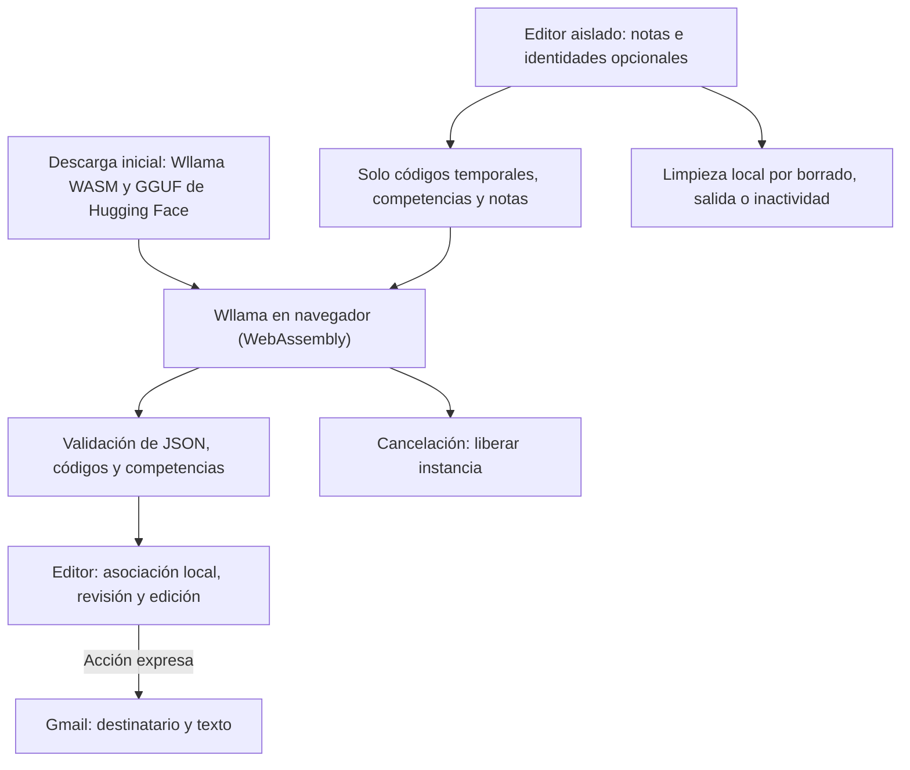

# CC-feedback con Wllama en el navegador

Rama experimental `webbrowser-llm`. Sustituye la inferencia previa por **Wllama (WebAssembly / llama.cpp) y Qwen 2.5 1.5B Instruct GGUF (Q4_K_M)**. No requiere cuenta de IA, API key, servidor de generación ni activar flags experimentales en Google Chrome. Es compatible con ordenadores de 8 GB de RAM al ejecutarse mediante WebAssembly por CPU. La rama principal conserva su implementación anterior.

## Características y compatibilidad

- **Sin flags**: Funciona directamente en cualquier navegador moderno (Google Chrome, Edge, Firefox, Safari) sin habilitar ajustes experimentales.
- **Bajo consumo de memoria**: El modelo cuantizado GGUF ocupa ~1 GB de RAM, funcionando sin problemas en ordenadores con 8 GB de RAM.
- **WebAssembly**: No exige aceleración gráfica WebGPU específica; aprovecha WebAssembly (con SIMD y multithreading cuando esté disponible).
- **Caché en el dispositivo**: Tras la primera descarga desde Hugging Face, el modelo se guarda en el almacenamiento local del navegador (IndexedDB) para arranques rápidos y uso offline.

## Uso

1. Sirve la carpeta por HTTPS o localhost. No abras `index.html` como `file://`.
2. Pulsa **Cargar modelo Wllama**. La primera vez descargará el runtime Wasm y los pesos del modelo GGUF mostrando el porcentaje de progreso. Las siguientes veces cargará directamente desde la caché local.
3. Pega hasta diez filas de notas por lote. Se mantienen cabeceras, nombre, correo y total opcionales, notas entre 0 y 10, y nombres/correos de ejemplo locales si se omiten.
4. Genera. Se procesa una fila cada vez con el modelo local; se muestra el número de fila y el tiempo transcurrido. Una salida incompleta se rechaza sin recurrir a IA remota.
5. Abre cada borrador colapsado, revisa y edita. Editar invalida la confirmación. Gmail se abre solo tras revisión y acción expresa; no se envía correo automáticamente. Sustituye las direcciones `example.invalid` antes de enviar.

```text
1 2 3 4 5 6
2 3 4 3 2 2
9 3 4 5 6 4
```

El botón **Descargar de memoria / cancelar carga** libera la instancia del motor Wllama y su memoria RAM.

## Adecuación al RGPD

Las notas, recomendaciones y códigos se procesan localmente en el dispositivo. Nombres, correos y total permanecen en el editor aislado (iframe con sandbox y Content Security Policy restrictivo) y nunca se entregan al motor Wllama. La generación no utiliza servicios en la nube ni APIs remotas de IA.

Si el docente conserva la correspondencia con el alumnado, el centro sigue tratando datos personales; el procesamiento local no equivale a anonimato ni a cumplimiento automático. Antes del uso real deben validarse la calidad educativa, las condiciones y licencia del modelo, la información institucional, conservación, seguridad del dispositivo y autorización del centro. Gmail recibe el destinatario y el texto al abrir el borrador mediante su URL.

Las identidades y borradores se retiran al borrar, cancelar, salir o tras quince minutos de inactividad, con comprobación al volver de suspensión. La entrada se conserva temporalmente para reintentar errores. `privacidad.html` contiene la información de esta rama; no se carga `.env`.

## Flujo de datos



## Arquitectura y límites

- `app.js`: inicialización de Wllama, descarga y caché del modelo GGUF, progreso, streaming con tokens, cancelación y comunicación con el editor.
- `editor.html` y `editor.js`: marco `sandbox` sin `allow-same-origin`; aísla el DOM y las identidades del alumnado.
- `core.js`: validación de entradas, construcción de prompts con rúbricas y correspondencia exacta de respuestas.
- `rubricas.js`: rúbricas oficiales para guiar las recomendaciones pedagógicas.

## Verificación

`node --test tests/core.test.cjs` comprueba la validación y transformación de datos. `tests/browser.cjs` simula Wllama para validar aislamiento de identidades, generación local, integración con Gmail, errores y cancelación.
