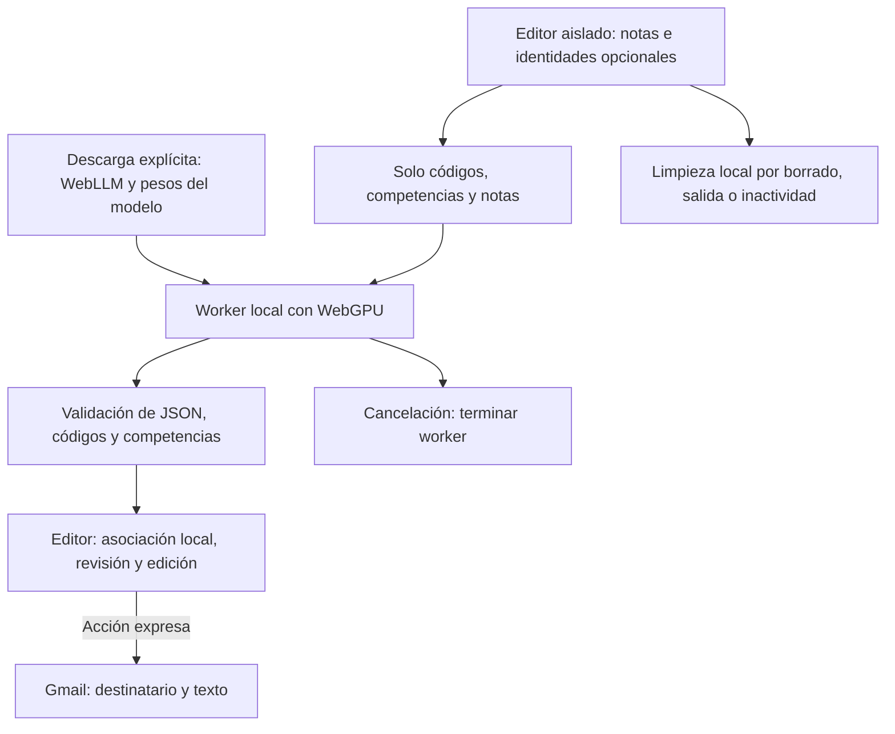

# CC-feedback con WebLLM en el navegador

Rama experimental `webbrowser-llm`, 9 de octubre de 2026. Sustituye Puter/Gemini por inferencia local con **WebLLM 0.2.85 y Qwen2.5-1.5B-Instruct-q4f32_1-MLC**. No requiere cuenta de IA, API key ni servidor de generación. La rama principal conserva su implementación anterior.

## Uso

1. Sirve la carpeta por HTTPS o localhost. No abras `index.html` como `file://`.
2. Pulsa **Cargar modelo local**. Requiere un navegador con WebGPU, aceleración gráfica y suficiente memoria. La primera carga descarga archivos grandes; el progreso corresponde a la preparación del modelo. Los pesos pueden quedar en la caché del navegador.
3. Pega hasta diez filas de notas por lote. Se mantienen cabeceras, nombre, correo y total opcionales, notas entre 0 y 10, y nombres/correos de ejemplo locales si se omiten.
4. Genera. Se procesa una fila cada vez con el modelo local; se muestra el número de fila y el tiempo. El límite de espera es diez minutos por fila. Una salida incompleta se rechaza, sin publicar resultados parciales ni recurrir a IA remota.
5. Abre cada borrador colapsado, revisa y edita. Editar invalida la confirmación. Gmail se abre solo tras revisión y acción expresa; no se envía correo automáticamente. Sustituye las direcciones `example.invalid` antes de enviar.

```text
1 2 3 4 5 6
2 3 4 3 2 2
9 3 4 5 6 4
```

Cancelar una generación destruye el worker y libera su contexto; para reintentar hay que cargar el modelo de nuevo, normalmente desde caché. **Descargar de memoria / cancelar carga** también permite interrumpir la descarga o liberar el motor. No elimina los pesos almacenados: para ello usa la opción del navegador de borrar datos de este sitio. No se guardan prompts ni respuestas en la caché de modelos por el código de la aplicación. La retirada de memoria no garantiza sobrescritura física.

## Adecuación al RGPD

Las notas, recomendaciones y códigos se procesan en un worker del dispositivo. Nombres, correos y total permanecen en el editor aislado y no se entregan al motor. La generación no usa Puter, Gemini ni una API remota. La carga del runtime y del modelo sí conecta con proveedores de distribución, que pueden recibir datos de conexión; no deben confundirse esas descargas con inferencia en la nube. Las dependencias externas siguen siendo código de confianza y deben revisarse.

Si el docente conserva la correspondencia con el alumnado, el centro sigue tratando datos personales; procesamiento local no equivale a anonimato ni a cumplimiento automático. Antes del uso real deben validarse la calidad educativa, las condiciones y licencia del modelo, la información institucional, conservación, seguridad del dispositivo y autorización del centro. Gmail recibe el destinatario y el texto al abrir el borrador, mediante su URL. Las copias, mensajes y hojas originales tienen conservación separada.

Las identidades y borradores se retiran al borrar, cancelar, salir o tras quince minutos de inactividad, con comprobación al volver de suspensión. La entrada se conserva temporalmente para reintentar errores. `privacidad.html` contiene la información de esta rama; no se carga `.env`.

## Flujo de datos



## Arquitectura y límites

- `app.js`: carga y ciclo de vida del worker, progreso, cancelación y comunicación con el editor.
- `llm-worker.js`: importa la versión fijada de WebLLM desde `esm.run`, carga el modelo de su catálogo y genera JSON con esquema. Reinicia el contexto entre filas y tras terminar.
- `editor.html` mantiene `sandbox` sin `allow-same-origin`; el contenedor y las dependencias no pueden leer su DOM. No relajar ese aislamiento.
- `core.js` conserva la validación de entradas, los prompts con rúbricas y la correspondencia exacta de respuestas. No se modifican notas ni se infieren niveles sin correspondencia definida.
- Modelo pequeño: la calidad en castellano y la velocidad dependen del equipo; no se promete equivalencia con Gemini. No hay fallback remoto.

## Verificación y publicación

`node --test tests/core.test.cjs` comprueba el procesamiento de datos. `node tests/browser.cjs` usa Playwright y un motor simulado servido en la ruta del módulo WebLLM, para comprobar el worker real, aislamiento, cancelación, errores y revisión. `CC_BROWSER` permite indicar el ejecutable Chromium/Edge. Estas pruebas no acreditan calidad ni rendimiento del modelo real.

Antes de uso real: cargar el modelo en los ordenadores del centro, generar con datos ficticios, revisar calidad en castellano y memoria, comprobar las peticiones de red durante la generación y la eliminación del contexto. No se afirma funcionamiento completamente offline: una primera carga y recursos no almacenados necesitan red.

Publicar `index.html`, `editor.html`, `app.js`, `llm-worker.js`, `core.js`, `editor.js`, `rubricas.js`, `shell.css`, `style.css`, `privacidad.html` y `assets/`. No subir datos ni claves. La creación de esta rama no cambia la web publicada desde `main`.

Fuentes: [WebLLM](https://webllm.mlc.ai/docs/), [catálogo fijado](https://github.com/mlc-ai/web-llm/blob/v0.2.85/src/config.ts), [modelo y licencia](https://huggingface.co/mlc-ai/Qwen2.5-1.5B-Instruct-q4f32_1-MLC).
