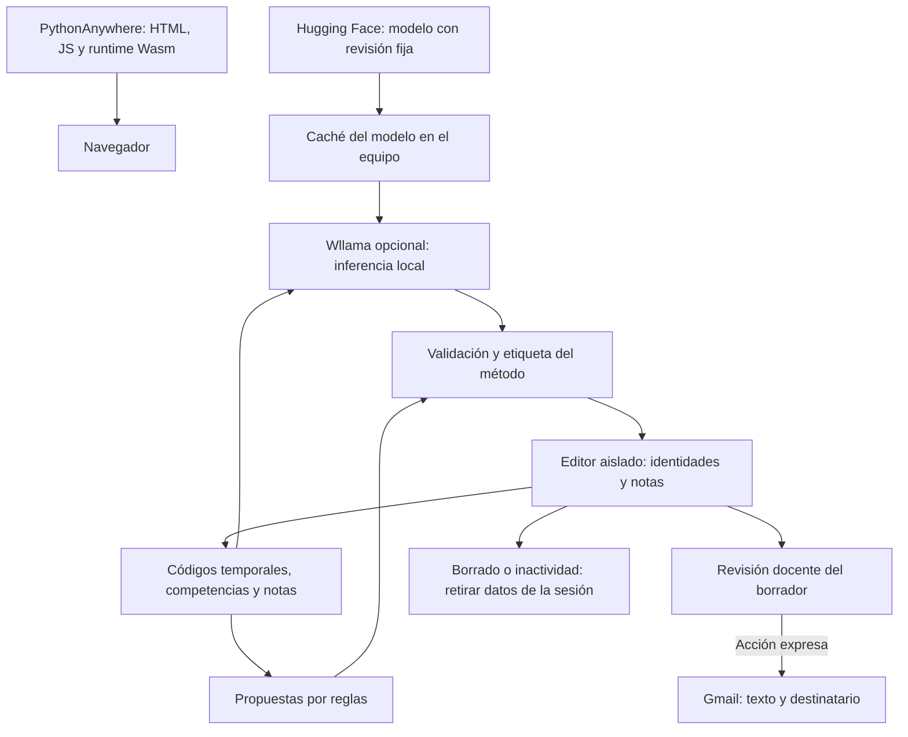

# CC-feedback: propuestas formativas locales

Rama `webbrowser-llm`. Combina propuestas por reglas con IA opcional **Wllama 3.8.1 y Qwen 2.5 0.5B Instruct GGUF Q4_K_M**, ejecutada en el navegador por CPU. PythonAnywhere sirve los archivos de la web; la aplicación no incluye un servidor de inferencia.

## Uso

1. Abre la web por HTTPS o localhost. Pega hasta **40 filas** de notas de 0 a 10. Cabecera, nombre, correo y total son opcionales. Sin nombres se asigna Alumno1, Alumno2, etc.; los correos de ejemplo deben sustituirse antes de enviar.
2. Elige propuestas por reglas para empezar sin descargar un modelo. Para IA, pulsa «Cargar IA Wllama» y selecciona la opción de IA en el editor. Prueba una fila antes de un lote: el rendimiento y la memoria dependen del dispositivo.
3. Cada borrador indica **Propuestas por reglas**, **Con IA local** o **Mixto**. Si la IA no está cargada, falla o entrega texto incompleto, se indica que se han usado reglas. Esta etiqueta describe el origen, no garantiza calidad pedagógica.
4. Abre el borrador colapsado, revisa y adapta. Editarlo invalida la confirmación. Gmail solo se abre tras revisión y acción expresa; no se envía correo automáticamente.
5. Cancelar envía una señal de interrupción, espera a que el motor la atienda y libera su instancia antes de permitir otra generación. La interrupción puede tardar durante una operación Wasm o la inicialización. Los resultados tardíos se descartan. Borrar los datos o caducar la sesión también libera el motor; para volver a usar IA hay que cargarlo de nuevo desde la caché.

```text
1 2 3 4 5 6
2 3 4 3 2 2
9 3 4 5 6 4
```

## Criterios pedagógicos

Las notas no se convierten automáticamente en niveles de rúbrica. Las propuestas por reglas plantean actividades, sin atribuir hábitos, personalidad o conductas observadas. La IA recibe instrucciones equivalentes, pero puede incumplirlas: la revisión docente sigue siendo necesaria. No se presentan estas reglas como equivalencias aprobadas por el centro. Cualquier futura conversión nota–nivel debe validarse institucionalmente.

## Privacidad y adecuación al RGPD

Nombres, correos y total permanecen en el editor aislado. El motor recibe códigos temporales, competencias y notas; la generación es local. Los datos del alumnado y borradores no se guardan deliberadamente en almacenamiento persistente. Se retiran al borrar, cancelar, salir o tras quince minutos de inactividad; la suspensión puede retrasar la limpieza. Los errores conservan temporalmente la entrada para reintentar.

El runtime se sirve desde `assets/vendor`, junto con la web. El modelo se descarga de Hugging Face desde una revisión fija, configurada en `model-config.js`. PythonAnywhere y el distribuidor del modelo pueden tratar IP y metadatos de conexión. Gmail recibe destinatario y texto al abrir el borrador. El procesamiento local no garantiza anonimato ni cumplimiento automático: deben completarse responsable, DPD, base jurídica, conservación, condiciones de proveedores y autorización del centro.

Solo el modelo se almacena en la caché `cc-feedback-model-v1` (Cache Storage). «Limpiar caché» elimina esa caché y comprueba que desaparece; no borra otros datos del origen ni cachés antiguas de Wllama. Para restos de versiones anteriores, utiliza la gestión de almacenamiento del navegador. Si no hay espacio o permiso para caché, se intenta cargar en memoria. No se garantiza funcionamiento offline completo ni compatibilidad universal.

## Flujo de datos



## Despliegue y rendimiento

Publica los archivos de esta rama, incluidos `model-config.js` y `assets/vendor`, en PythonAnywhere. No utilices el ZIP histórico de `dist`: no se actualiza automáticamente. Sirve `.js` como JavaScript y `.wasm` como `application/wasm`, por HTTPS. No se ha comprobado desde este repositorio la configuración del despliegue real.

El motor muestra el número real de hilos tras cargar. Para habilitar varios hilos, evalúa las cabeceras `Cross-Origin-Opener-Policy: same-origin` y `Cross-Origin-Embedder-Policy: require-corp`. Deben probarse en el dominio real con el iframe, descargas y apertura de Gmail. No se modifican automáticamente las cabeceras del servidor. Tras la primera fila con IA se ofrece una estimación orientativa para las restantes; no se guarda entre sesiones.

El runtime oficial se incluye con versión fija; su paquete se verificó contra la integridad SHA-512 publicada en npm. Los pesos no se incluyen en Git. Consulta la licencia incluida en `assets/vendor/wllama-3.8.1/LICENCE` y las condiciones del modelo antes de autorizar su uso.

## Verificación

`node --test tests/core.test.cjs` verifica entradas y correspondencia de resultados. `node tests/browser.cjs` requiere Playwright y un navegador; `CC_BROWSER` permite indicar su ruta. El navegador utiliza un Wllama simulado: comprueba reglas, IA, etiquetas de sustitución, aislamiento, revisión, cancelación, borrado selectivo y caducidad, pero no acredita calidad ni rendimiento del modelo real.

Antes de publicar, prueba con datos ficticios en equipos del centro: descarga, una fila y lote, cancelación durante descarga/generación, revisión del contenido y ausencia de envío de notas en la pestaña de red. Comprueba también los registros y condiciones de PythonAnywhere.

## Prueba experimental de GPU

Abre «Prueba de aceleración GPU» y pulsa «Comprobar GPU». La prueba solicita un adaptador y un dispositivo WebGPU; no modifica políticas ni requiere abrir chrome://gpu. Una respuesta positiva no garantiza que el modelo sea compatible o más rápido.

Selecciona GPU antes de cargar el modelo y pulsa «Probar fila ficticia». Utiliza la misma estructura de seis competencias y límite de respuesta que la generación habitual. La descarga y carga se excluyen del tiempo. El límite de 120 segundos cancela la inferencia; la interrupción puede tardar en ser atendida por el motor. Se distingue una respuesta completa de una que necesita reglas.

La interfaz solo confirma transferencia de capas a GPU si el motor la comunica en su registro de inicialización; en caso contrario indica «aceleración efectiva no confirmada». Nunca interpreta los hilos de CPU como uso de GPU. No hay cambio automático a CPU tras un fallo: retira el modelo y selecciona CPU expresamente para comparar. No se guardan los resultados de la prueba. Validar en el navegador y equipo reales antes de recomendar este modo.
