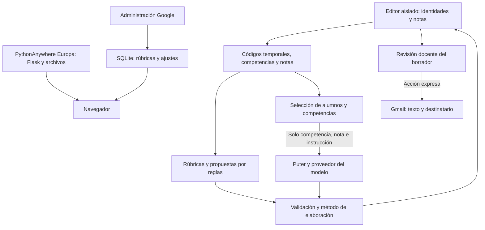

# CC-feedback con Puter

Rama `puter-llm`, creada desde `webbrowser-llm` conservando el estado de la aplicación. La versión de inferencia local sigue disponible en esa rama. Esta variante sustituye Wllama por Puter para las sugerencias opcionales. Conserva Flask, administración Google, SQLite, rúbricas, borradores por reglas, mejora por competencia, revisión docente y aislamiento de identidades.

## Uso

1. Abre la web por HTTPS o localhost. Introduce hasta 40 filas con seis notas entre 0 y 10. Cabecera, nombre, correo y total son opcionales. Sin identidad se crean Alumno1, Alumno2 y correos de ejemplo que deben sustituirse antes de enviar.
2. Genera los borradores con rúbricas. Este paso no conecta con Puter ni descarga modelos.
3. Para IA, pulsa **Conectar con Puter**. Solo entonces se carga `https://js.puter.com/v2/`. El botón cambia a **Acceder a Puter**. Pulsa de nuevo para abrir la autenticación mediante un gesto explícito del usuario.
4. Selecciona alumnos o pulsa **Mejorar con IA**. Se solicita una sugerencia por competencia, de forma secuencial, con progreso. Las valoraciones de rúbrica siguen calculándose mediante código. Cada petición contiene solo el nombre canónico de una competencia, su nota y una instrucción pedagógica derivada.
5. El borrador indica cuántas sugerencias han cambiado. Respuestas inválidas, truncadas o iguales no cuentan como mejora. Se conservan las sugerencias editadas por el docente. Cualquier cambio aplicado exige revisar de nuevo antes de abrir Gmail.
6. **Cancelar generación** detiene la cola y descarta respuestas tardías. No garantiza cancelar el procesamiento o borrar una solicitud ya recibida por Puter. Borrar datos retira también los borradores del editor.

```text
1 2 3 4 5 6
2 3 4 3 2 2
9 3 4 5 6 4
```

## Configuración de Puter

`model-config.js` contiene configuración pública, sin secretos: SDK, modelo `gemini-3.5-flash-lite` y límite de espera de 90 segundos por petición. El modelo se puede cambiar por otro compatible con Puter. La cuenta Puter gestiona el acceso y las cuotas o costes que correspondan. No se necesita una clave de API en `.env`. La cuenta Puter es independiente del acceso Google del panel administrativo.

La integración usa `puter.ai.chat(messages, {model, normalize: true, stream: false, max_tokens: 160, temperature: 0.5})`. Lee `response.message.content` y `response.finish_reason`. Un error de red, cuenta, cuota o tiempo detiene las peticiones restantes de ese alumno y conserva sus textos previos cuando no se han obtenido sugerencias utilizables.

Fuentes de integración: [chat](https://docs.puter.com/AI/chat/), [respuesta](https://docs.puter.com/Objects/chatresponse/) y [autenticación](https://docs.puter.com/Auth/signIn/). No se ha verificado una cuenta real ni el coste o rendimiento efectivo del modelo.

## Criterios pedagógicos

La programación selecciona niveles de rúbrica con estos intervalos: menor de 5, de 5 a menos de 7, de 7 a menos de 8,5 y desde 8,5. El centro debe validar estos intervalos y las correspondencias entre competencias y subcompetencias. Puter solo propone sugerencias. El docente revisa antes de utilizar los resultados o abrir Gmail.

## Privacidad y adecuación al RGPD

Nombres, correos y total permanecen en el editor con sandbox sin `allow-same-origin` y CSP restrictiva. El puente interno transmite códigos temporales, competencias y notas. Los códigos tampoco se incorporan al prompt externo. La aplicación no envía a Puter nombres, correos, total, borradores, rúbricas administrativas ni textos libres del alumnado.

**Las notas y competencias sí salen del dispositivo al solicitar mejoras.** Puter y el proveedor del modelo pueden tratar además información de cuenta y conexión. Esta separación reduce la información transmitida, pero no garantiza anonimato ni cumplimiento del RGPD. Antes del uso real, el centro debe revisar proveedores, condiciones, conservación, transferencias y autorización con su DPD. Mientras tanto, utiliza datos ficticios.

La aplicación no guarda deliberadamente notas o borradores en SQLite ni en almacenamiento web persistente. SQLite guarda configuración pedagógica; Google gestiona la autenticación administrativa y la sesión incluye datos de la cuenta. Las rúbricas y consejos se distribuyen públicamente: no deben incluir datos personales. `ADMIN_USER` vacío o con `*` permite todas las cuentas corporativas verificadas, por lo que debe configurarse la lista autorizada.

Borrar, salir o quince minutos de inactividad retiran los datos del editor. La suspensión puede retrasarlo. El SDK puede conservar su sesión de autenticación. La limpieza local no borra datos de Puter, Google, exportaciones, portapapeles ni copias externas. «Limpiar caché antigua» elimina únicamente `cc-feedback-model-v1`, para equipos que usaron la otra rama. Los archivos históricos Wllama permanecen en el repositorio pero esta variante no los carga ni descarga pesos.

## Flujo de datos



## Despliegue en PythonAnywhere

Publica esta rama completa y pulsa **Reload**. `.env` se carga junto a `server.py`, con prioridad de variables del proceso. Conserva `GOOGLE_CLIENT_ID`, `GOOGLE_CLIENT_SECRET`, `SECRET_KEY` estable y `ADMIN_USER` del panel. `DATABASE_PATH` relativo se resuelve desde el directorio de la aplicación. No se necesita instalar un modelo ni un paquete Python de Puter.

La página principal utiliza `Cross-Origin-Opener-Policy: same-origin-allow-popups` para permitir la autenticación de Puter. `Cross-Origin-Embedder-Policy: unsafe-none` evita bloquear su SDK y ventanas externas. Se conserva el sandbox/CSP del editor y la lista explícita de archivos públicos que bloquea `.env`, SQLite y Python. No vuelvas a imponer globalmente las cabeceras de multihilo de Wllama mediante un proxy.

Los mapeos estáticos de PythonAnywhere pueden omitir cabeceras Flask. Nunca publiques la raíz del repositorio. Comprueba estilos y scripts del editor, acceso a Puter y administración después de recargar. El cambio de rama no acredita un despliegue. La protección CSRF y el refuerzo de sesiones administrativas siguen pendientes de revisión.

## Pruebas

- `node --test tests/core.test.cjs`: entradas, minimización y correspondencia de resultados.
- `node tests/enhancement.browser.cjs`: requiere Playwright y navegador; `BROWSER_EXECUTABLE` permite indicar su ejecutable. Simula Puter, verifica conexión explícita, payload sin identidades, seis sugerencias, fallos, truncado, ediciones, revisión y cancelación con respuesta tardía.
- `python tests/test_server.py`: usa una copia temporal y una base de datos simulada; comprueba `.env`, archivos privados y cabeceras.

Las pruebas simuladas no acreditan disponibilidad, calidad, velocidad, cuotas ni condiciones del servicio real. Antes de publicar, prueba una fila ficticia con una cuenta autorizada. El informe Word y el portal común describen la variante local y no cambian automáticamente por crear esta rama.
