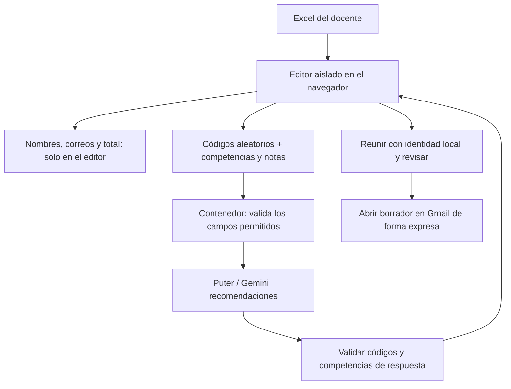

# Adecuación al RGPD y actualización: cc-feedback

## WebApp y funcionalidad

Web estática en https://cuatrovientos-ci.github.io/cc-feedback/. El docente pega las notas de competencias; Gemini, mediante Puter, genera recomendaciones; el docente revisa y prepara un borrador en Gmail. No hay envío automático. La revisión conserva esa funcionalidad.

## Funcionamiento revisado

El contenedor que ejecuta Puter no puede leer el documento del editor, cuyo iframe carece de `allow-same-origin`. Solo recibe registros reconstruidos con campos permitidos. No hay nombres en códigos, hashes de correos, nombres de curso, fechas, comentarios ni cabeceras arbitrarias. El modelo no decide destinatarios ni modifica las notas mostradas. Una respuesta incompleta o con códigos desconocidos se rechaza entera.

## Anonimización: alcance real

La medida es seudonimización: existe una relación temporal que permite reconstruir localmente el destinatario y se conservan perfiles individuales de notas. No se afirma anonimato irreversible. La cuenta del docente y los metadatos de conexión también son tratados por el proveedor. La AEPD distingue esta situación de datos verdaderamente anónimos; el RGPD sigue siendo aplicable.

## Requisitos para aceptación

1. Responsable educativo y DPD: validar finalidad, base jurídica, registro de actividades, información a personas interesadas, riesgos y, cuando corresponda, evaluación de impacto, teniendo en cuenta menores.
2. Revisar las condiciones concretas de Puter y del servicio/modelo de Google: roles, encargo cuando corresponda, subencargados, entrenamiento, retención, transferencias internacionales, seguridad y atención de derechos. La seudonimización no sustituye estas comprobaciones.
3. Revisar GitHub Pages, que trata datos de navegación, y la cuenta institucional de Gmail. Confirmar que preparar URLs de Gmail con los textos es aceptable para el centro; si no lo fuera, desarrollar un canal institucional diferente.
4. Completar `privacidad.html`: identidad y contacto del responsable y DPD, base jurídica, destinatarios, garantías y canal de derechos, conservación de originales, informes, mensajes, registros y copias. El temporizador de 15 minutos solo retira la sesión local.
5. Validar rúbricas, cabeceras y escalas. Las notas numéricas no se convierten en niveles de forma automática; las recomendaciones requieren revisión pedagógica antes de uso.
6. Probar el proveedor real con una cuenta autorizada y datos ficticios. Las pruebas automáticas locales simulan la IA y no prueban las condiciones contractuales ni la disponibilidad real del modelo.
7. Autorizar personas usuarias, alcance y canal de envío antes de usar datos reales. El aviso de pruebas no es autenticación ni una barrera técnica de acceso.

## Publicación

Publicar los archivos enumerados en README y verificar GitHub Pages con HTTPS. Nunca añadir `allow-same-origin` al editor. Conservar Bootstrap y su licencia local. Comprobar la petición a IA con personas ficticias distintivas y verificar ausencia de sus nombres y correos. Probar respuestas reordenadas, errores de formato, revisión y Gmail. Documentar versión y resultado.

La copia local no actualiza la web pública. El portal mantiene el enlace en pausa hasta publicación y autorización. La pausa del enlace no desactiva la URL directa; si el centro exige suspensión efectiva, debe despublicarse o restringirse el servicio.

## Propuesta de migración y usos previos

La migración a PythonAnywhere EU es una propuesta propia de Ander Frago para las otras aplicaciones, no una solicitud de que Dirección la ejecute. Esta web se aloja en GitHub Pages y requeriría un traslado independiente.

Los cambios no borran las filas identificadas enviadas con versiones anteriores a Puter/Gemini. El responsable y DPD deben inventariar el uso previo, revisar conservación/supresión con proveedores y valorar cualquier incidente real, sin presumir que haya ocurrido una brecha.

## Fuentes oficiales consultadas el 8 de octubre de 2026

- AEPD, diferencia entre anonimización y seudonimización: https://www.aepd.es/preguntas-frecuentes/0-conceptos-basicos
- AEPD, centros educativos: https://www.aepd.es/infografias/criterios-tratamiento-datos-personales-centros-educativos.pdf
- Puter, autenticación y restricciones de origen: https://docs.puter.com/Auth/signIn/
- GitHub Pages y registro de IP: https://docs.github.com/en/pages/getting-started-with-github-pages/what-is-github-pages
- RGPD: https://www.boe.es/doue/2016/119/L00001-00088.pdf
